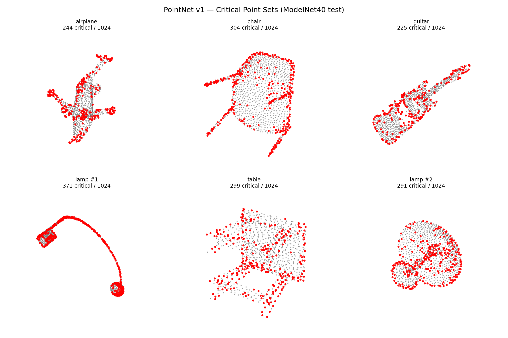
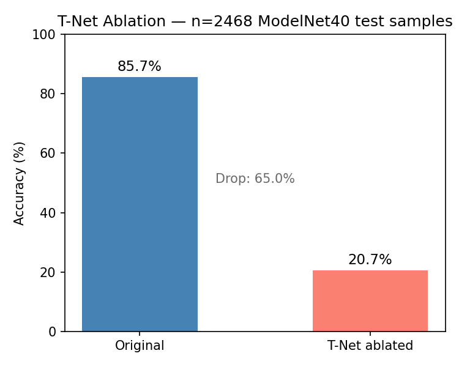
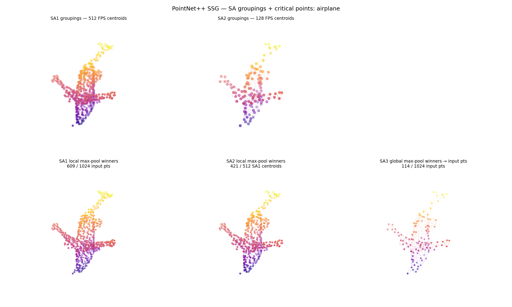
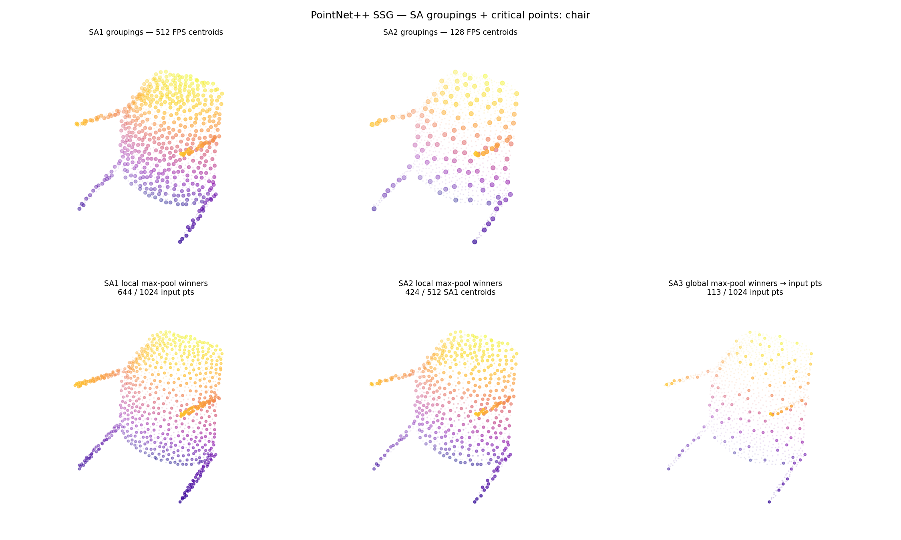
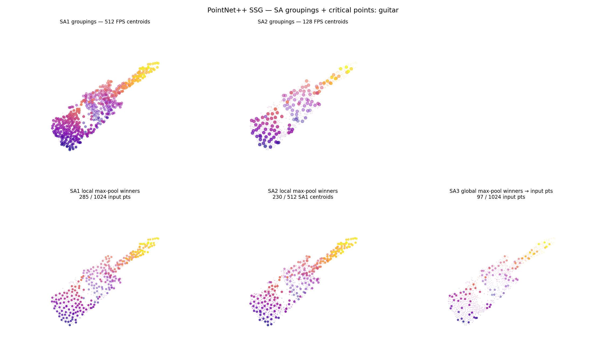
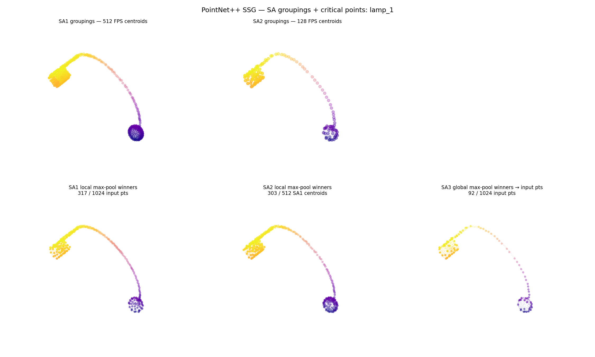
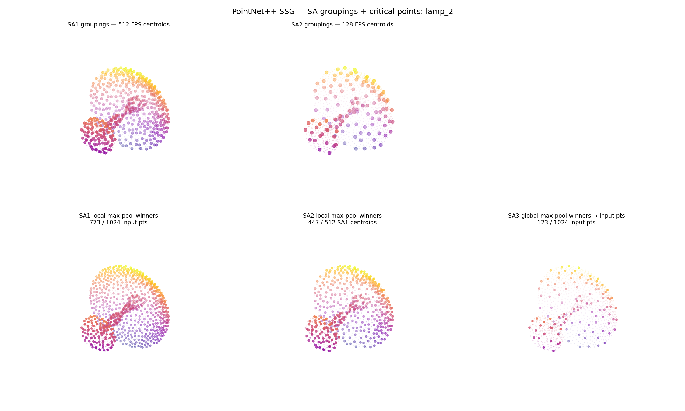
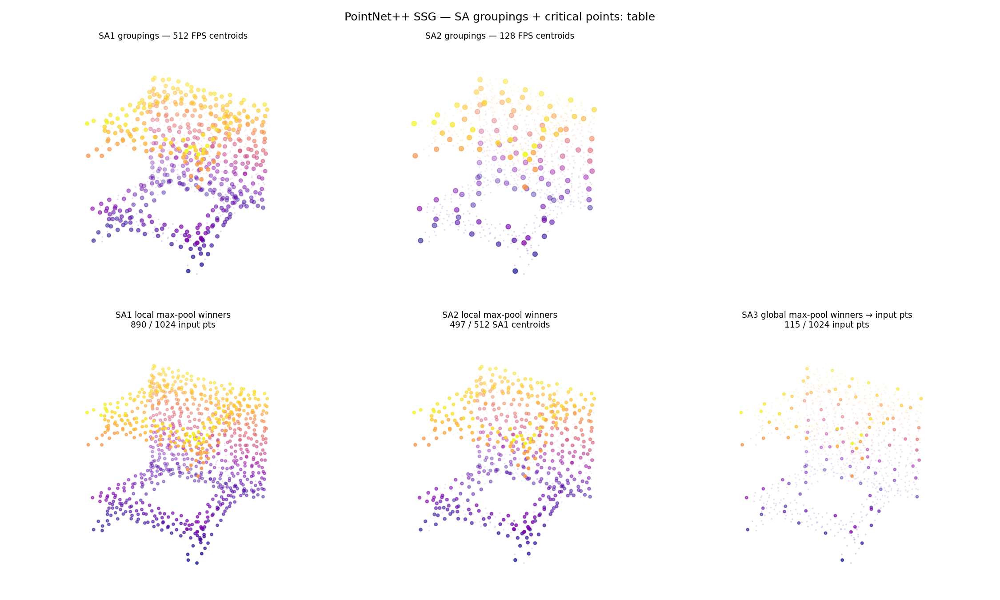

# 3D Point Cloud Architectures: A One-Day Experiment

## What I set out to understand

PointNet's global max-pool is elegant but throws away spatial structure. PointNet++ adds hierarchy to fix that. But what does each design choice actually *do* to the learned representation — and where does that matter for CAD geometry? These experiments dig into the internals: which points are used, what breaks when you remove a component, and how information compresses across layers.

---

## Architectures covered

| | PointNet | PointNet++ |
|---|---|---|
| Aggregation | Global max-pool over all N points | Hierarchical local max-pool (SA layers) |
| Receptive field | Full shape in one step | Local → regional → global (staged radii) |
| Density robustness | None (all points weighted equally by max-pool) | Multiple radii handle density variation |
| Key inductive bias | Permutation invariance via symmetric function | Local structure matters; FPS preserves coverage |

---

## Experiments

### Exp 0: PointNet v1 Baseline Training

**Hypothesis:** Short training with flat LR would give a usable checkpoint for further experiments.

**Result:** 85.7% test accuracy (paper baseline: ~89%). Three runs needed to find a stable configuration — Adam flat LR oscillated, ScheduleFree with aggressive LR overfit, ScheduleFree at lr=0.0003 converged cleanly.

**What I learned:** The optimizer choice interacts with LR in non-obvious ways. ScheduleFree removes schedule tuning but doesn't fix an aggressive step size — it just overfits more smoothly. The 3.5-point gap from the paper is attributable to 10 epochs and no augmentation; fully acceptable as a working checkpoint.

---

### Exp 1: Critical Points Visualization (PointNet v1)

**Hypothesis:** Critical points (those that win at least one max-pool channel) should concentrate on edges, corners, and thin structures. Interior and flat-plane duplicate points should be eliminated.

**Result:** 22–36% of input points are critical, varying by shape. Points cluster densely along edges and thin structures (lamp arms, chair legs, guitar neck), with sparse or zero coverage on homogeneous flat surfaces.

**What I learned:** PointNet's global max-pool behaves like an edge detector, not a surface sampler. The paper's §4.3 description of the critical set as capturing the "skeleton or boundary" implies broader surface coverage than what the model actually uses — the real behavior is more selective. The lamp-to-lamp variation (371 vs 291 critical points for different instances) confirms the critical set is instance-specific: the geometry of a particular sample determines how many points the max-pool needs, not just its class.

---

### Exp 2: T-Net (STN3d) Ablation

**Hypothesis:** Removing the input T-Net would drop accuracy, but by ~10% at most — the dataset is largely orientation-normalized, so misalignment shouldn't be catastrophic.

**Result:** 85.7% → 20.7% (−65 points). The ablated model is barely above chance for 40 classes.

**What I learned:** The T-Net isn't a preprocessing convenience — the downstream MLP layers are trained assuming their input is already aligned. Without the T-Net, features are out of distribution. The residual 20.7% comes from the feature-space T-Net (STN64d) still running on misoriented inputs, partially compensating. The magnitude of the drop was a genuine surprise; it means the network is more brittle to its own invariance assumptions than I expected.

---

### Exp 3: PointNet++ SA-Level Critical Points Visualization

**Hypothesis:** SA-level max-pool winners should progressively thin out with depth, converging toward geometrically distinctive regions at SA3 — mirroring PointNet v1's edge preference, but built up hierarchically.

**Result:** SA1 win rates vary widely (28–84%), driven by local surface density. SA3 converges all shapes to 86–119 winners (8–12%) regardless of SA1 count. SA3 winners are 2–3× sparser than PointNet v1's critical points for the same shapes.

| airplane | chair | guitar |
|---|---|---|
|  |  |  |

| lamp (1) | lamp (2) | table |
|---|---|---|
|  |  |  |

**What I learned:** The hypothesis was directionally right but mechanistically wrong. SA1 does resemble PointNet v1 — it tracks geometric density. But SA2/SA3 don't refine geometric distinctiveness; they do feature aggregation. By SA3, the model is pooling over learned local features, not raw geometry. The sparsity at SA3 reflects prior compression by FPS and local pooling, not sharper geometric focus. The lamp case (SA1→SA2 barely compresses, 31% → 29%) exposed ball-query padding behavior: underpopulated neighborhoods get their nearest point repeated, so almost all SA1 centroids along the arm survive to SA2. That's a real limitation for elongated or sparse geometries.

---

## Key intuitions

- **Max-pooling works as aggregation because** it is a symmetric function — order-invariant by construction. The cost is that it selects extremes, not averages. The critical point set is a direct consequence: only the points that "win" some feature dimension matter to the output.
- **FPS matters more than random sampling because** random sampling is likely to cluster in dense regions, leaving sparse or thin regions uncovered. FPS maximizes minimum pairwise distance, so it guarantees coverage — exactly what you need before local ball-query grouping.
- **T-Net coupling is deeper than it looks.** The network doesn't apply T-Net and then run an otherwise-independent MLP. The MLP layers are *trained into* the assumption that T-Net ran first. This makes the model a tightly coupled system, not a pipeline with an optional preprocessing stage.
- **PointNet++ compresses differently across levels.** SA1 pools over local raw geometry (like a mini-PointNet). SA2/SA3 pool over learned features from SA1. By the global descriptor, the information is no longer interpretable as geometric locations — it's a compressed feature representation built up hierarchically.

---

## What I'd do differently / next

Training PointNet v1 for only 10 epochs with no augmentation leaves the critical point set potentially under-developed — a fully-converged model might show more spatially uniform critical point coverage, which would help distinguish "edge detection is the true behavior" from "edge detection is an artifact of partial convergence." Running the same critical point analysis on a fully-trained checkpoint would settle this.